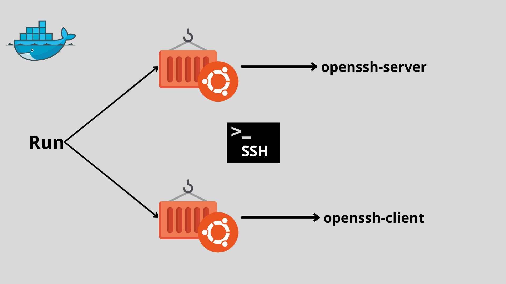

# Configuração de Conexão SSH entre Containers Ubuntu usando Docker

## Descrição
Este projeto tem como objetivo configurar de maneira simples e demonstrar a conexão SSH entre dois containers Ubuntu no Docker.É possível simular a comunicação entre **sistemas isolados em um ambiente de containerização.** O foco principal é o aprendizado em ambientes Docker.
 
## Pré-requisitos
- Docker instalado ([docs.docker](https://docs.docker.com/get-docker/))
- Internet
- Acesso ao terminal

## Estrutura do Projeto
Neste projeto, utilizarei a imagem do Ubuntu. Dois containers serão baseados nessa imagem, com um configurado para atuar como **servidor**, executando o OpenSSH, enquanto o outro será configurado como cliente, usando o OpenSSH Client para estabelecer a comunicação via SSH entre eles.



Vamos começar baixando a imagem do ubuntu com o simples comando
```
docker pull ubuntu
```

